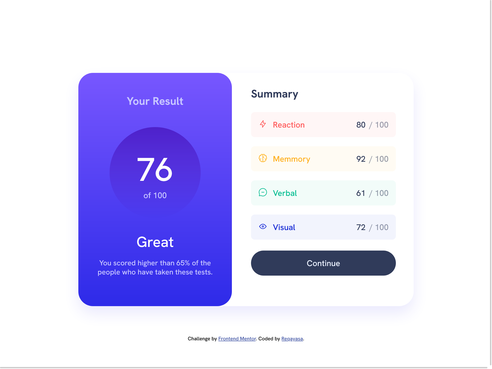

# Frontend Mentor - Results summary component solution

This is a solution to the [Results summary component challenge on Frontend Mentor](https://www.frontendmentor.io/challenges/results-summary-component-CE_K6s0maV). Frontend Mentor challenges help you improve your coding skills by building realistic projects. 

## Table of contents

- [Overview](#overview)
  - [The challenge](#the-challenge)
  - [Screenshot](#screenshot)
  - [Links](#links)
- [My process](#my-process)
  - [Built with](#built-with)
  - [What I learned](#what-i-learned)
  - [Continued development](#continued-development)
- [Author](#author)

**Note: Delete this note and update the table of contents based on what sections you keep.**

## Overview

### The challenge

Users should be able to:

- View the optimal layout for the interface depending on their device's screen size
- See hover and focus states for all interactive elements on the page

### Screenshot

-m
### Links

- Solution URL: [github](https://github.com/reqayasa/fmr-result-summary-component)
- Live Site URL: [vercel](https://fmr-result-summary-component.vercel.app/)

## My process

### Built with

- Semantic HTML5 markup
- CSS custom properties
- Flexbox
- Mobile-first workflow

### What I learned

Here i learned about mobile-first workflow, where i design the page for mobile, and after mobile complited i start thingking on desktop layout. Its quite challenging for me because the mobile vesion and desktop version is so difference but still simple.

I learned how to make custome component where i create one component (like item of summary) and make it have difference color. I try to search for the right way to do that but i not sure with my keyword, and i not realy undertand what i reading, so i work with my own way. I try to follow what i doing when i used bootstrap, like when i used bootstrap button, i just put another class to select the color i want.

### Continued development

I not sure if my markup and css (scss) to complicated or could be more complicated. The component look simple at firsh glance.
Anyway, there is something i still feel not right is:
- In mobile version, summary section should have max width so is not to wide. Here i only use one breakpoint at 960px
- In desktop version, all component should be placed more center, verticaly and horizontaly. it already center on horizontal, but not in vertical. at least not in smaller screen size
- maybe i should put all list item inside ul tag not inside div.

## Author

- Frontend Mentor - [@reqayasa](https://www.frontendmentor.io/profile/reqayasa)